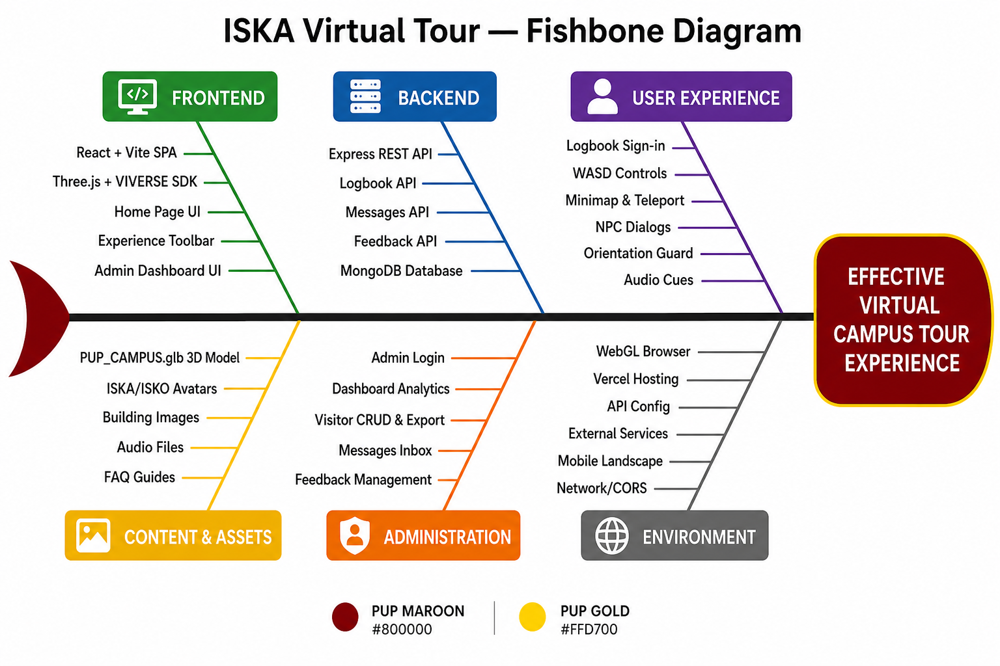
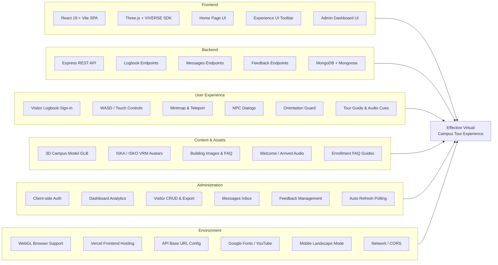

# ISKA Virtual Tour — Fishbone Diagram

A **fishbone diagram** (Ishikawa / cause-and-effect diagram) shows the factors that contribute to the main outcome of the ISKA-VT system.

---

## Effect (Fish Head)

**Effective Virtual Campus Tour Experience**

The goal: visitors can explore PUP Lopez campus online, sign the logbook, navigate buildings, and provide feedback — while admins monitor activity through the dashboard.



---

## Fishbone Diagram (Mermaid)



---

## Cause Categories & Sub-Causes

### 1. Frontend

| Sub-Cause | Component / Technology | Role |
|-----------|------------------------|------|
| React 19 + Vite SPA | `client/` | Single-page app, routing, fast dev build |
| Three.js + VIVERSE SDK | `ExperienceScene`, `BvhPhysicsWorld` | 3D rendering, physics, avatar locomotion |
| Home Page UI | `HomePage`, `Hero`, `NavBar` | Marketing landing, tour entry point |
| Experience UI Toolbar | `UI.tsx`, `AvatarPicker`, `Map2D` | In-tour controls and overlays |
| Admin Dashboard UI | `AdminPage`, tabs, charts | Staff monitoring interface |

### 2. Backend

| Sub-Cause | Component / Technology | Role |
|-----------|------------------------|------|
| Express REST API | `backend/server.js` | HTTP server on port 5000 |
| Logbook Endpoints | `/api/logbook` | Visitor sign-in, timeout, stats |
| Messages Endpoints | `/api/messages` | Contact form storage |
| Feedback Endpoints | `/api/feedback` | Tour rating submissions |
| MongoDB + Mongoose | `iska-vt` database | Persistent data storage |

### 3. User Experience

| Sub-Cause | Component / Technology | Role |
|-----------|------------------------|------|
| Visitor Logbook Sign-in | `LogbookFormDialog` | Required entry before touring |
| WASD / Touch Controls | VIVERSE character controller | Move through campus |
| Minimap & Teleport | `Map2D`, **M** key | Navigation aid |
| NPC Dialogs | `NPCDialog`, Guard & Professor | Campus information via **F** key |
| Orientation Guard | `OrientationGuard` | Blocks portrait mode on mobile |
| Tour Guide & Audio Cues | `TourGuideDialog`, `AudioManager` | Onboarding and feedback sounds |

### 4. Content & Assets

| Sub-Cause | Location | Role |
|-----------|----------|------|
| 3D Campus Model | `PUP_CAMPUS.glb` | Main campus environment |
| ISKA / ISKO Avatars | `avatars/Iska.vrm`, `Isko.vrm` | Visitor character selection |
| Building Images & FAQ | `public/images/` | Home cards, enrollment screenshots |
| Welcome / Arrived Audio | `public/audio/` | Immersive tour feedback |
| Enrollment FAQ Guides | `/resources/faq` | Regular, Irregular, Freshmen, Transferee steps |

### 5. Administration

| Sub-Cause | Component | Role |
|-----------|-----------|------|
| Client-side Auth | `AdminLoginForm`, `adminAuth.ts` | Admin session via env credentials |
| Dashboard Analytics | `StatsGrid`, charts | Visitor counts, ratings, destinations |
| Visitor CRUD & Export | `VisitorsTab`, PDF/CSV export | Manage logbook records |
| Messages Inbox | `MessagesTab` | Read contact form submissions |
| Feedback Management | `FeedbackTab` | Review tour ratings |
| Auto-Refresh Polling | `useAutoRefresh` | 15s–5m data refresh |

### 6. Environment & Infrastructure

| Sub-Cause | Detail | Role |
|-----------|--------|------|
| WebGL Browser Support | Chrome, Edge, Firefox | Required for 3D tour |
| Vercel Frontend Hosting | `vercel.json` SPA rewrites | Production static hosting |
| API Base URL Config | `VITE_API_BASE_URL` | Connects client to backend |
| Google Fonts / YouTube | External CDN | Typography and embedded videos |
| Mobile Landscape Mode | `enterKioskLandscape` | Better tour on phones |
| Network / CORS | `cors()` middleware | Cross-origin API access |

---

## How to Read the Diagram

```
                    Frontend ──────┐
                                   │
         Backend ──────────────────┤
                                   │
    User Experience ───────────────┼────▶  EFFECTIVE VIRTUAL
                                   │        CAMPUS TOUR EXPERIENCE
   Content & Assets ───────────────┤
                                   │
   Administration ───────────────┤
                                   │
      Environment ─────────────────┘
```

- **Fish head (right):** The outcome — a working virtual campus tour
- **Main bones (branches):** Six cause categories
- **Small bones (sub-causes):** Specific components, technologies, or features that support the outcome

---

## Related Documentation

- [Use Case Diagram](USE_CASES.md) — Visitor, Experience, and Admin flows
- [Network Infrastructure](NETWORK_INFRASTRUCTURE.md) — System architecture and data flows
