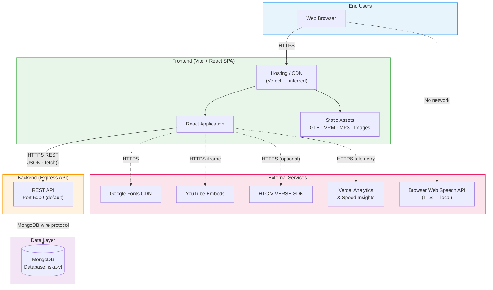
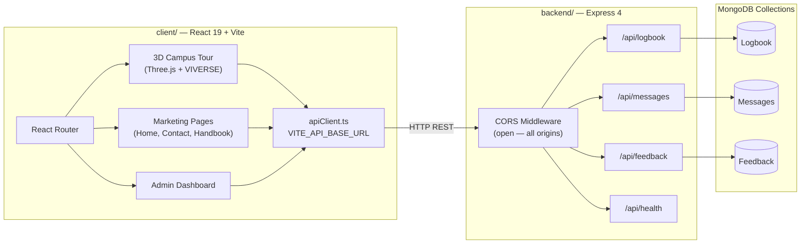
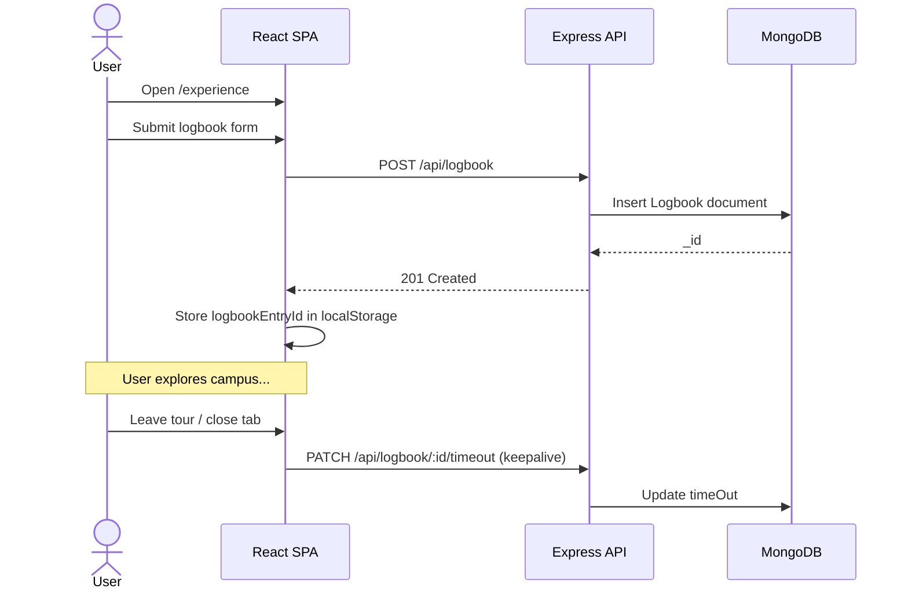
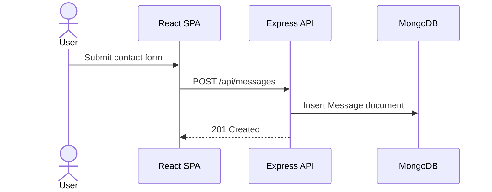
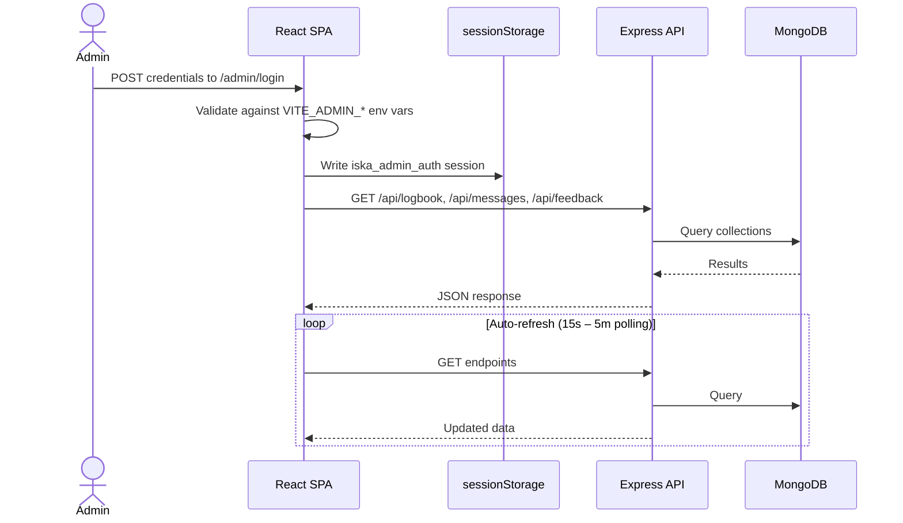
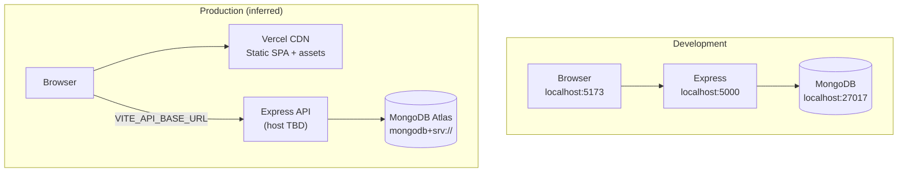

# ISKA Virtual Tour — Network Infrastructure

This document describes how the ISKA-VT system is structured, how components communicate, and which external services are involved.

---

## High-Level Architecture

---

## Component Topology

---

## Request Flows

### Visitor Logbook (3D Tour)

### Contact Form

### Admin Dashboard

> **Note:** Admin authentication is client-side only. The API has no server-side auth middleware.

---

## API Endpoints

| Prefix | Method | Path | Purpose |
|--------|--------|------|---------|
| Health | `GET` | `/api/health` | Service health check |
| Logbook | `POST` | `/api/logbook` | Create visitor entry |
| Logbook | `GET` | `/api/logbook` | List entries (paginated) |
| Logbook | `GET` | `/api/logbook/stats/summary` | Dashboard statistics |
| Logbook | `GET` | `/api/logbook/:id` | Get single entry |
| Logbook | `PATCH` | `/api/logbook/:id` | Update entry |
| Logbook | `PATCH` | `/api/logbook/:id/timeout` | Record session end time |
| Logbook | `DELETE` | `/api/logbook/:id` | Delete entry |
| Messages | `POST` | `/api/messages` | Submit contact message |
| Messages | `GET` | `/api/messages` | List messages |
| Messages | `GET` | `/api/messages/unread-count` | Unread count |
| Messages | `GET` | `/api/messages/:id` | Get single message |
| Messages | `PATCH` | `/api/messages/:id` | Update (e.g. mark read) |
| Messages | `DELETE` | `/api/messages/:id` | Delete message |
| Feedback | `POST` | `/api/feedback` | Submit tour feedback |
| Feedback | `GET` | `/api/feedback` | List feedback |
| Feedback | `GET` | `/api/feedback/unread-count` | Unread count |
| Feedback | `GET` | `/api/feedback/stats/summary` | Rating statistics |
| Feedback | `GET` | `/api/feedback/:id` | Get single feedback |
| Feedback | `PATCH` | `/api/feedback/:id` | Update feedback |
| Feedback | `DELETE` | `/api/feedback/:id` | Delete feedback |

**Default base URL (development):** `http://localhost:5000/api`

---

## Ports & Protocols

| Connection | Protocol | Endpoint |
|------------|----------|----------|
| Browser → Frontend | HTTPS | Vercel CDN (prod) or `localhost:5173` (dev) |
| Browser → Backend API | HTTP(S) REST | `localhost:5000/api/*` (configurable via `VITE_API_BASE_URL`) |
| Backend → MongoDB | MongoDB wire | `localhost:27017` (local) or Atlas `mongodb+srv://` |
| Browser → YouTube | HTTPS (iframe) | `youtube.com/embed/...` |
| Browser → Google Fonts | HTTPS | `fonts.googleapis.com` |
| Browser → VIVERSE | HTTPS | VIVERSE platform APIs (when `VITE_VIVERSE_APP_ID` is set) |
| Browser → Vercel Analytics | HTTPS | Vercel telemetry endpoints |

---

## Environment Variables

### Client (`client/.env`)

| Variable | Required | Description |
|----------|----------|-------------|
| `VITE_API_BASE_URL` | No | Backend API base URL. Default: `http://localhost:5000/api` |
| `VITE_VIVERSE_APP_ID` | No | HTC VIVERSE app ID for production 3D features |
| `VITE_ADMIN_USERNAME` | Prod only | Admin dashboard username |
| `VITE_ADMIN_PASSWORD` | Prod only | Admin dashboard password |

### Backend (`backend/.env`)

| Variable | Required | Description |
|----------|----------|-------------|
| `PORT` | No | HTTP listen port. Default: `5000` |
| `MONGODB_URI` | No | MongoDB connection string. Default: `mongodb://localhost:27017/iska-vt` |
| `NODE_ENV` | No | `development` or `production` (affects error detail in 500 responses) |

---

## Static Asset Delivery

All 3D models, audio, and images are bundled with the frontend — no separate object storage (S3, Cloudinary, etc.).

| Asset Type | Path | Examples |
|------------|------|----------|
| 3D models | `client/public/models/` | `PUP_CAMPUS.glb`, `avatars/Iska.vrm` |
| Audio | `client/public/audio/` | `welcome.mp3`, `arrived.mp3`, `teleported.mp3` |
| Images | `client/public/images/` | Campus map, building photos, FAQ screenshots |

---

## External Service Dependencies

| Service | Used For | Network Required |
|---------|----------|------------------|
| MongoDB | Persistent data (logbook, messages, feedback) | Yes — backend only |
| Google Fonts | Inter typeface | Yes — on page load |
| YouTube | Embedded campus/hymn videos | Yes — iframe embed |
| HTC VIVERSE SDK | 3D physics, locomotion, avatars | Optional — when app ID configured |
| Vercel Analytics | Usage telemetry | Yes — in production |
| Web Speech API | FAQ / marketing text-to-speech | No — browser-native |

---

## Development vs Production

| Aspect | Development | Production |
|--------|-------------|------------|
| Frontend | `npm run dev` → Vite `:5173` | Vercel (SPA rewrites via `vercel.json`) |
| Backend | `npm run dev` → Express `:5000` | Deployment target not configured in repo |
| Database | Local MongoDB `:27017` | Likely MongoDB Atlas |
| API URL | `http://localhost:5000/api` | Set at build time via `VITE_API_BASE_URL` |
| Admin auth | Fallback `admin` / `iska-admin` | Requires `VITE_ADMIN_*` env vars |

---

## Security Considerations

| Area | Current State | Recommendation |
|------|---------------|----------------|
| API authentication | None — all endpoints are public | Add server-side auth for admin CRUD operations |
| Admin login | Client-side only (`VITE_ADMIN_*` bundled in JS) | Move to server-side session/JWT auth |
| CORS | Open (`cors()` with default settings) | Restrict to known frontend origins in production |
| Credentials in frontend | `VITE_*` vars are visible in built bundle | Never store secrets in `VITE_` variables |

---

## What Is Not Used

The following are **not** part of the current network architecture:

- WebSockets / Socket.IO (dependency exists in `package.json` but is unused)
- Server-Sent Events (SSE)
- Cloud storage (S3, Cloudinary)
- Third-party TTS APIs (ElevenLabs, etc.)
- OAuth / SSO providers
- Redis, Postgres, or other databases
- Docker / nginx / reverse proxy configs
- CI/CD pipelines

Real-time admin updates use **HTTP polling** (`setInterval` at 15s–5m intervals), not persistent connections.
