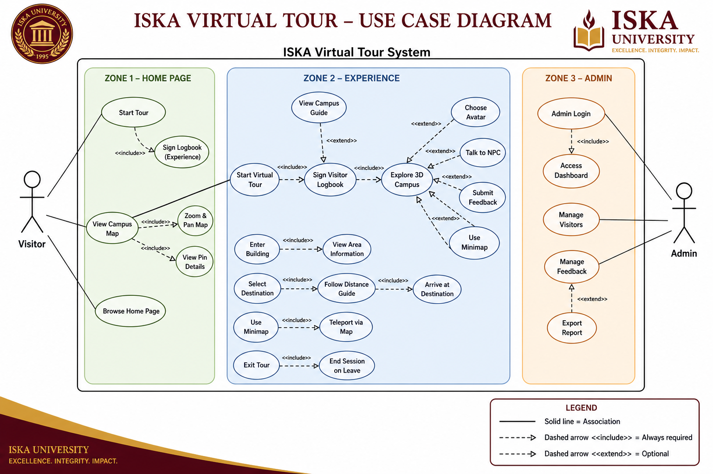
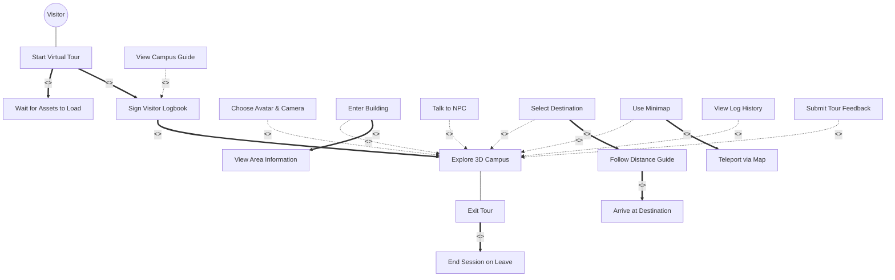
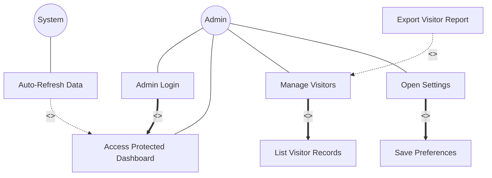
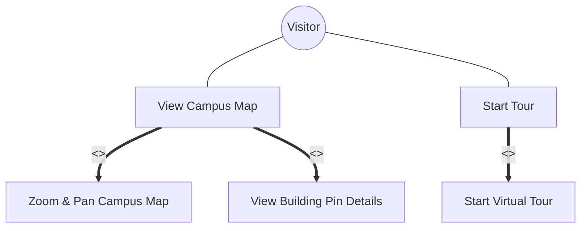
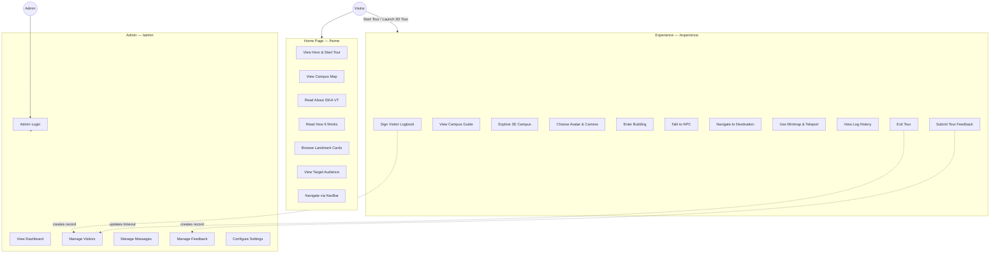
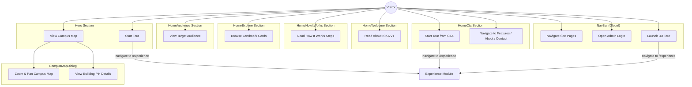
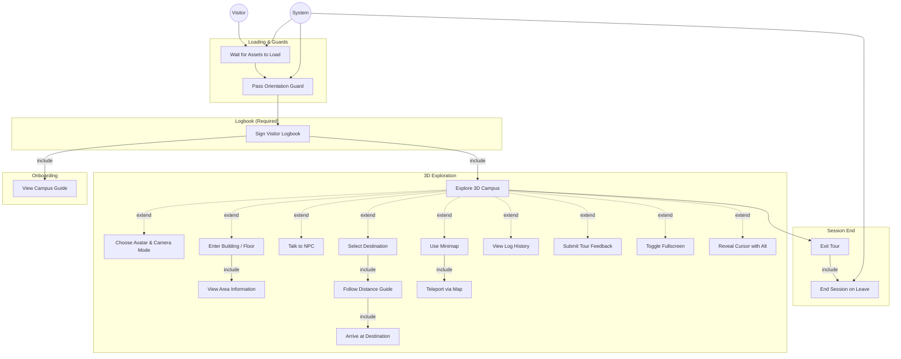
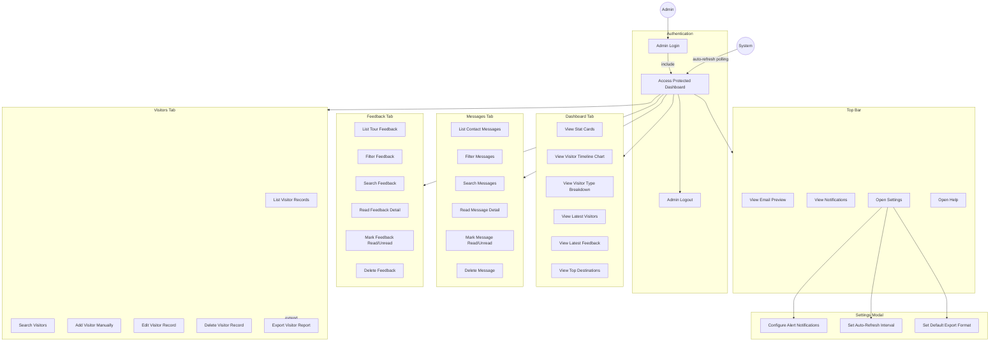
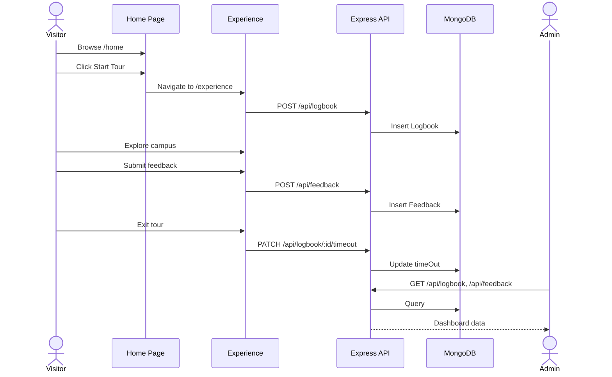

# ISKA Virtual Tour — Use Case Documentation

This document describes the use cases for the three main modules of ISKA-VT: **Home Page (Visitor)**, **Experience**, and **Admin**.

---

## Actors

| Actor | Description |
|-------|-------------|
| **Visitor** | Public user who browses the home page and takes the 3D virtual tour. No account required. |
| **Admin** | Campus staff who log in to monitor visitors, messages, and feedback. |
| **System** | Automated behaviors — session timeout, auto-refresh polling, audio cues, orientation guard. |

---

## Include & Extend Relationships

UML use case diagrams use two special relationships (there is no **exclude** — you likely mean **extend**):

| Relationship | Stereotype | Meaning | Arrow Direction |
|--------------|------------|---------|-----------------|
| **Include** | `<<include>>` | **Always happens** — the base use case must call the included use case every time | Base use case → included use case |
| **Extend** | `<<extend>>` | **Sometimes happens** — optional behavior that may run under certain conditions | Extending use case → base use case |

**Include example:** *Start Virtual Tour* always includes *Sign Visitor Logbook* — you cannot tour without signing in.

**Extend example:** *View Campus Guide* extends *Sign Visitor Logbook* — the guide appears after sign-in but can be skipped.



### Full Include & Extend Table (ISKA-VT)

#### Include — mandatory sub-flows

| Base Use Case | `<<include>>` | Included Use Case | Module |
|---------------|---------------|-------------------|--------|
| Start Tour | → | Sign Visitor Logbook | Home → Experience |
| Start Virtual Tour | → | Wait for Assets to Load | Experience |
| Start Virtual Tour | → | Sign Visitor Logbook | Experience |
| Sign Visitor Logbook | → | Explore 3D Campus | Experience |
| View Campus Map | → | Zoom & Pan Campus Map | Home |
| Enter Building | → | View Area Information | Experience |
| Select Destination | → | Follow Distance Guide | Experience |
| Follow Distance Guide | → | Arrive at Destination | Experience |
| Use Minimap | → | Teleport via Map | Experience |
| Exit Tour | → | End Session on Leave | Experience |
| Admin Login | → | Access Protected Dashboard | Admin |
| Open Settings | → | Save Preferences | Admin |
| Manage Visitors | → | List Visitor Records | Admin |

#### Extend — optional add-on behaviors

| Base Use Case | `<<extend>>` | Extending Use Case | Condition |
|---------------|---------------|-------------------|-----------|
| Sign Visitor Logbook | ← | View Campus Guide | After first sign-in |
| Explore 3D Campus | ← | Choose Avatar & Camera | Visitor opens avatar picker |
| Explore 3D Campus | ← | Enter Building | Visitor approaches entrance |
| Explore 3D Campus | ← | Talk to NPC | Visitor presses F near NPC |
| Explore 3D Campus | ← | Select Destination | Visitor opens destination picker |
| Explore 3D Campus | ← | Use Minimap | Visitor presses M |
| Explore 3D Campus | ← | View Log History | Visitor opens log panel |
| Explore 3D Campus | ← | Submit Tour Feedback | Manual open or after 60 seconds |
| Explore 3D Campus | ← | Toggle Fullscreen | Visitor clicks fullscreen button |
| Explore 3D Campus | ← | Reveal Cursor (Alt) | Visitor holds Alt key |
| Manage Visitors | ← | Export Visitor Report | Admin clicks export |
| Access Dashboard | ← | Auto-Refresh Data | Refresh interval enabled in settings |

---

## UML Use Case Diagram — Experience (Include & Extend)



### UML Use Case Diagram — Admin (Include & Extend)



### UML Use Case Diagram — Home Page (Include & Extend)



---

## System Overview



---

## Module 1 — Home Page (Visitor)

**Route:** `/home`  
**Page:** `HomePage`  
**Layout:** `MarketingLayout` with `NavBar` and `Footer`

### Use Case Diagram



### Use Case Details

| ID | Use Case | Component | Description |
|----|----------|-----------|-------------|
| **UC-H01** | Start Tour | `Hero` | Click **Start Tour** button → navigates to `/experience` |
| **UC-H02** | View Campus Map | `Hero` → `CampusMapDialog` | Click **View Map** → opens interactive 2D campus map dialog |
| **UC-H03** | Read About ISKA VT | `HomeWelcome` | Read project intro, highlights (3D walkthrough, mini-map, free access), and developer teaser card |
| **UC-H04** | Read How It Works | `HomeHowItWorks` | Read 4 steps: Launch the Tour, Explore Freely, Use the Mini-Map, Discover Landmarks |
| **UC-H05** | Browse Landmark Cards | `HomeExplore` | View 10 read-only building cards: Administration Building, Pylon, Yumul Building, Comlab 1 & 2, Engineering Building, Education Building, Health and Sciences Building, Nantes Building, Gymnasium, Grandstand |
| **UC-H06** | View Target Audience | `HomeAudience` | View audience chips: Prospective Students, New Enrollees, Parents & Visitors, Alumni & Partners |
| **UC-H07** | Start Tour from CTA | `HomeCta` | Click **Start Tour** in the bottom call-to-action section |
| **UC-H08** | Navigate to Related Pages | `HomeCta` | Click **View Features**, **About Campus**, or **Contact** links |
| **UC-H09** | Zoom & Pan Campus Map | `CampusMapDialog` | Interact with `CampusMap.png` — zoom and pan the map image |
| **UC-H10** | View Building Pin Details | `CampusMapDialog` | Click map pins to view building name and details |
| **UC-NAV1** | Navigate Site Pages | `NavBar` | Use links: Home, Features, About PUPLQ (dropdown), Resources (dropdown), Contact |
| **UC-NAV2** | Open Admin Login | `NavBar` | Click **Login** → navigates to `/admin/login` |
| **UC-NAV3** | Launch 3D Tour | `NavBar` | Click **Launch 3D Tour** → navigates to `/experience` |

### Home Page Sections

```
┌─────────────────────────────────────────────────┐
│  NavBar — Logo, links, Login, Launch 3D Tour    │
├─────────────────────────────────────────────────┤
│  Hero — Start Tour, View Map, PUP Lopez headline  │
├─────────────────────────────────────────────────┤
│  HomeWelcome — About the Tour, project intro      │
├─────────────────────────────────────────────────┤
│  HomeHowItWorks — 4-step getting started guide    │
├─────────────────────────────────────────────────┤
│  HomeExplore — 10 landmark building cards          │
├─────────────────────────────────────────────────┤
│  HomeAudience — 4 target audience chips           │
├─────────────────────────────────────────────────┤
│  HomeCta — Start Tour, Features, About, Contact   │
├─────────────────────────────────────────────────┤
│  Footer — social links, scroll to top           │
└─────────────────────────────────────────────────┘
```

---

## Module 2 — Experience (Virtual Tour)

**Route:** `/experience`  
**Page:** `ExperienceScene`  
**Tech:** React Three Fiber + VIVERSE SDK (`BvhPhysicsWorld`)

### Use Case Diagram



### Use Case Details

| ID | Use Case | Component | Description |
|----|----------|-----------|-------------|
| **UC-E01** | Wait for Assets to Load | `LoadingOverlay` | 3D models, textures, and audio preload before tour starts |
| **UC-E02** | Pass Orientation Guard | `OrientationGuard` | Mobile users in portrait mode are prompted to rotate to landscape |
| **UC-E03** | Sign Visitor Logbook | `LogbookFormDialog` | **Required** modal — enter full name, visitor type, destination, purpose → `POST /api/logbook` → stored in `localStorage` |
| **UC-E04** | View Campus Guide | `TourGuideDialog` | 2-page tutorial after logbook: Page 1 (movement controls), Page 2 (map, feedback, exit) |
| **UC-E05** | Explore 3D Campus | `Experience` + `Canvas` | Move with WASD / arrow keys / touch; first- or third-person camera |
| **UC-E06** | Choose Avatar & Camera Mode | `AvatarPicker` | Select ISKA or ISKO avatar; toggle first-person / third-person view |
| **UC-E07** | Enter Building / Floor | `EnterButton` | Approach entrance zone → click center-dot enter button → teleport inside |
| **UC-E08** | View Area Information | `AreaInfo` | Popup with building description, image, and room list when entering a floor zone |
| **UC-E09** | Talk to NPC | `NPCDialog` | Approach Guard or Professor → press **F** → branching dialog tree |
| **UC-E10** | Select Destination | `DestinationPicker` | Search and pin a campus location from the destination list |
| **UC-E11** | Follow Distance Guide | `DistanceHUD` | HUD shows meters remaining to pinned destination |
| **UC-E12** | Arrive at Destination | `DestinationChecker` | Auto-detect arrival within ~1.5m → clear pin → play "arrived" audio |
| **UC-E13** | Use Minimap | `Map2D` + `MiniMapOverlay` | Circular minimap preview; press **M** to toggle expanded map |
| **UC-E14** | Teleport via Map | `Map2D` | Click fixed pins or custom pin on expanded map → teleport with audio |
| **UC-E15** | View Log History | `LogHistory` | Paginated list of recent public visitor logbook entries |
| **UC-E16** | Submit Tour Feedback | `Feedback` | Rate 1–5 stars + optional comment → `POST /api/feedback`; auto-prompted after 60 seconds |
| **UC-E17** | Toggle Fullscreen | `FullScreenButton` | Enter/exit browser fullscreen mode |
| **UC-E18** | Reveal Cursor with Alt | `useAltCursorReveal` | Hold **Alt** to exit pointer lock and reveal system cursor |
| **UC-E19** | Exit Tour | `ExitTourButton` | Confirm exit → `PATCH /api/logbook/:id/timeout` → clear session → navigate to `/home` |
| **UC-E20** | End Session on Leave | `useLogbookTimeout` | Auto `PATCH` timeout on tab close, page unload, or route leave |

### Logbook Form Fields

| Field | Values |
|-------|--------|
| Full Name | Text (required) |
| Visitor Type | Student, Faculty, Staff, Visitor, Alumni, Guest |
| Destination | Grandstand, Lab 1, Library, Cafeteria, Gymnasium, Other |
| Purpose | Text, max 200 characters (required) |

### Experience UI Toolbar

```
┌──────────────────────────────────────────────────────────┐
│  [Avatar] [Exit] [Fullscreen] [Destination] [Log] [Feedback]  │
│  Distance HUD (when destination pinned)                    │
├──────────────────────────────────────────────────────────┤
│                    Floor Label (top center)                │
│                                                          │
│              3D Campus (Three.js Canvas)                 │
│                                                          │
│  Minimap (bottom-right) — press M to expand              │
└──────────────────────────────────────────────────────────┘
```

### Keyboard Shortcuts

| Key | Action |
|-----|--------|
| **W / A / S / D** | Move avatar |
| **Arrow keys** | Move avatar |
| **M** | Toggle expanded minimap |
| **F** | Talk to nearest NPC |
| **Alt (hold)** | Reveal system cursor |

### Movement Lock Rules

Movement is blocked while:
- Logbook form is open
- NPC dialog is active
- Tour guide dialog is open

---

## Module 3 — Admin

**Routes:** `/admin/login`, `/admin`  
**Pages:** `AdminLoginPage`, `AdminDashboard` → `AdminPage`  
**Auth:** Client-side (`VITE_ADMIN_USERNAME` / `VITE_ADMIN_PASSWORD` → `sessionStorage`)

### Use Case Diagram



### Use Case Details

#### Authentication

| ID | Use Case | Component | Description |
|----|----------|-----------|-------------|
| **UC-A01** | Admin Login | `AdminLoginForm` | Enter username/password → validate against env vars → store session in `sessionStorage` |
| **UC-A02** | Access Protected Dashboard | `AdminProtectedRoute` | `/admin` redirects to `/admin/login` if no session |
| **UC-A09** | Admin Logout | `AccountDropdown` | Clear session → navigate to `/admin/login` |

#### Dashboard Tab

| ID | Use Case | Component | Description |
|----|----------|-----------|-------------|
| **UC-A03** | View Stat Cards | `StatsGrid` | Total visitors (month), today, this week, active sessions, average rating |
| **UC-A04** | View Visitor Timeline Chart | `VisitorsBarChart` | Bar chart with daily / weekly / monthly / yearly period toggle |
| **UC-A05** | View Visitor Type Breakdown | `VisitorTypePieChart` | Pie chart by logbook `visitorType` |
| **UC-A06** | View Latest Visitors | `LatestVisitorsList` | Recent logbook entries |
| **UC-A07** | View Latest Feedback | `LatestFeedbackList` | Recent tour ratings and comments |
| **UC-A08** | View Top Destinations | `TopDestinationsList` | Ranked logbook destinations |

#### Visitors Tab

| ID | Use Case | Component | Description |
|----|----------|-----------|-------------|
| **UC-A10** | List Visitor Records | `VisitorsTable` | Paginated table of all logbook entries |
| **UC-A11** | Search Visitors | `AdminSearchInput` | Filter by name, type, destination, purpose |
| **UC-A12** | Add Visitor Manually | `AddVisitorModal` | Create logbook entry via `POST /api/logbook` |
| **UC-A13** | Edit Visitor Record | `EditVisitorModal` | Update entry via `PATCH /api/logbook/:id` |
| **UC-A14** | Delete Visitor Record | `ConfirmDialog` | Delete entry via `DELETE /api/logbook/:id` |
| **UC-A15** | Export Visitor Report | `ExportDropdown` | Export today / this week / this month as PDF or CSV |

#### Messages Tab

| ID | Use Case | Component | Description |
|----|----------|-----------|-------------|
| **UC-A16** | List Contact Messages | `MessageList` | Paginated inbox from contact form submissions |
| **UC-A17** | Filter Messages | `MessagesToolbar` | Filter: All / Unread / Read |
| **UC-A18** | Search Messages | `AdminSearchInput` | Text search across messages |
| **UC-A19** | Read Message Detail | `MessageDetail` | View sender name, email, body; auto-marks as read |
| **UC-A20** | Mark Message Read/Unread | `MessageDetail` | Toggle via `PATCH /api/messages/:id` |
| **UC-A21** | Delete Message | `ConfirmDialog` | Delete via `DELETE /api/messages/:id` |

#### Feedback Tab

| ID | Use Case | Component | Description |
|----|----------|-----------|-------------|
| **UC-A22** | List Tour Feedback | `FeedbackList` | Paginated list with star ratings |
| **UC-A23** | Filter Feedback | `FeedbackToolbar` | Filter: All / Unread / Read |
| **UC-A24** | Search Feedback | `AdminSearchInput` | Text search across feedback |
| **UC-A25** | Read Feedback Detail | `FeedbackDetail` | View rating, comment, linked visitor name |
| **UC-A26** | Mark Feedback Read/Unread | `FeedbackDetail` | Toggle via `PATCH /api/feedback/:id` |
| **UC-A27** | Delete Feedback | `ConfirmDialog` | Delete via `DELETE /api/feedback/:id` |

#### Settings & Top Bar

| ID | Use Case | Component | Description |
|----|----------|-----------|-------------|
| **UC-A28** | View Email Preview | `EmailDropdown` | Preview recent unread contact messages |
| **UC-A29** | View Notifications | `NotificationsDropdown` | Bell alerts for new visitors and messages |
| **UC-A30** | Open Settings | `SettingsModal` | Configure preferences (saved in `localStorage`) |
| **UC-A31** | Open Help | `HelpModal` | In-app help for dashboard, visitors, and export |
| **UC-A32** | Configure Alert Notifications | `SettingsModal` | Toggle toast alerts for new data |
| **UC-A33** | Set Auto-Refresh Interval | `SettingsModal` | Off / 15s / 30s / 1m / 5m polling |
| **UC-A34** | Set Default Export Format | `SettingsModal` | PDF or CSV default for visitor export |

### Admin Dashboard Layout

```
┌────────────┬──────────────────────────────────────────────┐
│  Sidebar   │  TopBar — Email, Notifications, Account      │
│            ├──────────────────────────────────────────────┤
│  Dashboard │                                              │
│  Visitors  │  Tab Content:                                │
│  Messages  │  • Dashboard — stats, charts, lists          │
│  Feedback  │  • Visitors — table, CRUD, export            │
│            │  • Messages — inbox, read/unread, delete     │
│            │  • Feedback — ratings, read/unread, delete   │
└────────────┴──────────────────────────────────────────────┘
```

---

## Cross-Module Data Flows



| Visitor Action | API Endpoint | Admin Consumption |
|----------------|--------------|-------------------|
| Sign logbook (UC-E03) | `POST /api/logbook` | Visitors tab (UC-A10) |
| Exit tour (UC-E19/E20) | `PATCH /api/logbook/:id/timeout` | Active sessions stat (UC-A03) |
| Submit feedback (UC-E16) | `POST /api/feedback` | Feedback tab (UC-A22) |

---

> See [Include & Extend Relationships](#include--extend-relationships) at the top of this document for the full UML `<<include>>` and `<<extend>>` tables and diagrams.
